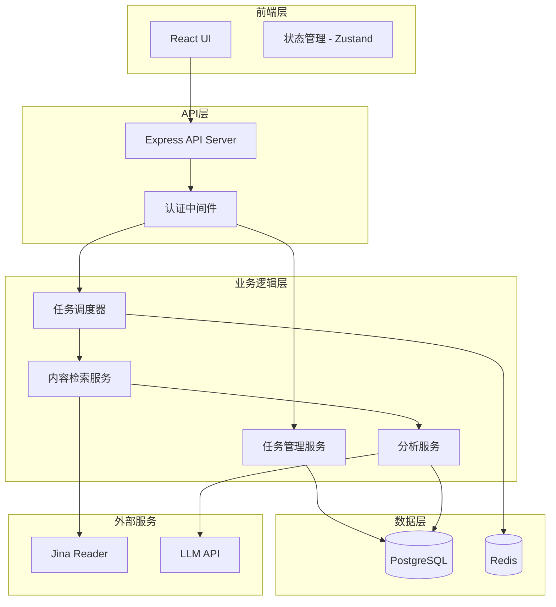

# 设计文档 - 金融合规政策监测系统

## Overview

金融合规政策监测系统是一个自动化的Web应用，旨在帮助金融合规人员监测和追踪指定网站上的合规政策关键词变化。系统采用前后端分离架构，前端提供简洁年轻化的用户界面，后端负责任务调度、内容检索和数据分析。

### 核心功能
- 监测任务的创建和管理
- 定时自动执行检索任务
- 多网站并行检索
- 智能内容提取和总结
- 历史对比和跨网站对比分析
- 可视化结果展示

### 技术栈选择
- **前端**: React + TypeScript + Tailwind CSS
- **后端**: Node.js + Express + TypeScript
- **数据库**: PostgreSQL (关系型数据) + Redis (任务队列和缓存)
- **任务调度**: Bull (基于Redis的任务队列)
- **内容检索**: Jina Reader API
- **AI总结**: OpenAI API 或类似的LLM服务

## Architecture

### 系统架构图



### 架构层次说明

1. **前端层**: 提供用户交互界面，采用组件化设计，响应式布局
2. **API层**: RESTful API，处理HTTP请求，身份验证和授权
3. **业务逻辑层**: 核心业务逻辑，包括任务管理、调度、检索和分析
4. **数据层**: 持久化存储和缓存
5. **外部服务**: 第三方API集成

## Components and Interfaces

### 前端组件设计

#### 设计风格指南

**色彩方案** (金融行业 + 年轻化)
- 主色调: `#1E40AF` (深蓝色 - 专业可信)
- 辅助色: `#3B82F6` (亮蓝色 - 年轻活力)
- 强调色: `#10B981` (绿色 - 成功/正向)
- 警告色: `#F59E0B` (橙色 - 警告)
- 错误色: `#EF4444` (红色 - 错误)
- 背景色: `#F9FAFB` (浅灰 - 清爽)
- 卡片背景: `#FFFFFF` (白色)
- 文字主色: `#111827` (深灰)
- 文字辅色: `#6B7280` (中灰)

**设计原则**
- 简洁: 去除不必要的装饰，突出核心功能
- 年轻化: 使用圆角、渐变、微动效
- 专业: 保持金融行业的严谨和可信
- 响应式: 适配桌面和移动设备

#### 核心组件结构

```
src/
├── components/
│   ├── layout/
│   │   ├── Header.tsx           # 顶部导航栏
│   │   ├── Sidebar.tsx          # 侧边栏导航
│   │   └── Layout.tsx           # 主布局容器
│   ├── task/
│   │   ├── TaskList.tsx         # 任务列表
│   │   ├── TaskCard.tsx         # 任务卡片
│   │   ├── TaskForm.tsx         # 任务创建/编辑表单
│   │   └── TaskDetail.tsx       # 任务详情
│   ├── result/
│   │   ├── ResultDashboard.tsx  # 结果仪表板
│   │   ├── SummaryView.tsx      # 总结视图
│   │   ├── ComparisonView.tsx   # 对比视图
│   │   └── CrossSiteView.tsx    # 跨网站对比视图
│   ├── common/
│   │   ├── Button.tsx           # 按钮组件
│   │   ├── Input.tsx            # 输入框组件
│   │   ├── Card.tsx             # 卡片组件
│   │   ├── Badge.tsx            # 标签组件
│   │   ├── Modal.tsx            # 模态框组件
│   │   └── Loading.tsx          # 加载状态组件
│   └── charts/
│       ├── TrendChart.tsx       # 趋势图表
│       └── DiffVisualization.tsx # 差异可视化
├── pages/
│   ├── Dashboard.tsx            # 仪表板页面
│   ├── Tasks.tsx                # 任务管理页面
│   ├── Results.tsx              # 结果查看页面
│   └── Settings.tsx             # 设置页面
├── stores/
│   ├── taskStore.ts             # 任务状态管理
│   └── resultStore.ts           # 结果状态管理
└── services/
    └── api.ts                   # API调用封装
```

#### 关键页面设计

**1. Dashboard (仪表板)**
- 顶部: 统计卡片 (总任务数、活跃任务、今日执行、待处理警告)
- 中部: 最近执行的任务列表 (卡片式布局)
- 底部: 趋势图表 (执行频率、成功率)

**2. Tasks (任务管理)**
- 左侧: 任务列表 (支持筛选: 全部/活跃/暂停/失败)
- 右侧: 任务详情/创建表单
- 操作: 创建、编辑、暂停、恢复、删除

**3. Results (结果查看)**
- 顶部: 任务选择器 + 执行历史时间线
- 标签页:
  - 总结文档: Markdown渲染，带来源引用
  - 对比报告: 差异高亮显示 (新增绿色、删除红色、修改黄色)
  - 跨网站对比: 表格或卡片对比视图
  - 原始内容: 可展开的原文查看

### 后端组件设计

#### API接口定义

**任务管理 API**
```typescript
// 创建任务
POST /api/tasks
Request: {
  name: string;
  keywords: string[];
  targetWebsites: string[];
  schedule: {
    type: 'once' | 'daily' | 'weekly' | 'monthly';
    time?: string; // HH:mm
    dayOfWeek?: number; // 0-6
    dayOfMonth?: number; // 1-31
  };
}
Response: {
  taskId: string;
  status: 'created';
}

// 获取任务列表
GET /api/tasks?status=active&page=1&limit=20
Response: {
  tasks: Task[];
  total: number;
  page: number;
}

// 获取任务详情
GET /api/tasks/:taskId
Response: Task

// 更新任务
PUT /api/tasks/:taskId
Request: Partial<Task>
Response: Task

// 暂停/恢复任务
PATCH /api/tasks/:taskId/status
Request: { status: 'active' | 'paused' }
Response: Task

// 删除任务
DELETE /api/tasks/:taskId
Response: { success: boolean }

// 手动触发任务
POST /api/tasks/:taskId/execute
Response: { executionId: string }
```

**结果查询 API**
```typescript
// 获取任务执行历史
GET /api/tasks/:taskId/executions?page=1&limit=20
Response: {
  executions: Execution[];
  total: number;
}

// 获取执行详情
GET /api/executions/:executionId
Response: {
  executionId: string;
  taskId: string;
  status: 'running' | 'completed' | 'failed';
  startTime: string;
  endTime?: string;
  results: RetrievalResult[];
  summary?: SummaryDocument;
  comparison?: ComparisonReport;
  crossSiteAnalysis?: CrossSiteAnalysis;
}

// 获取总结文档
GET /api/executions/:executionId/summary
Response: SummaryDocument

// 获取对比报告
GET /api/executions/:executionId/comparison
Response: ComparisonReport

// 获取跨网站对比
GET /api/executions/:executionId/cross-site
Response: CrossSiteAnalysis

// 获取原始内容
GET /api/executions/:executionId/original/:websiteIndex
Response: OriginalContent
```

#### 核心服务类

**TaskManager (任务管理服务)**
```typescript
class TaskManager {
  async createTask(taskData: CreateTaskDTO): Promise<Task>
  async getTask(taskId: string): Promise<Task>
  async listTasks(filters: TaskFilters): Promise<PaginatedTasks>
  async updateTask(taskId: string, updates: Partial<Task>): Promise<Task>
  async deleteTask(taskId: string): Promise<void>
  async pauseTask(taskId: string): Promise<Task>
  async resumeTask(taskId: string): Promise<Task>
}
```

**TaskScheduler (任务调度器)**
```typescript
class TaskScheduler {
  async scheduleTask(task: Task): Promise<void>
  async unscheduleTask(taskId: string): Promise<void>
  async executeTask(taskId: string): Promise<string> // returns executionId
  private async processExecution(executionId: string): Promise<void>
}
```

**ContentRetriever (内容检索服务)**
```typescript
class ContentRetriever {
  async retrieveFromWebsite(
    website: string, 
    keywords: string[]
  ): Promise<RetrievalResult>
  
  private async fetchPageContent(url: string): Promise<string>
  private async extractDocumentUrls(html: string): Promise<string[]>
  private async readDocument(url: string): Promise<string> // uses Jina Reader
  private async searchKeywords(
    content: string, 
    keywords: string[]
  ): Promise<KeywordMatch[]>
}
```

**AnalysisService (分析服务)**
```typescript
class AnalysisService {
  async generateSummary(
    results: RetrievalResult[]
  ): Promise<SummaryDocument>
  
  async compareResults(
    currentResult: RetrievalResult, 
    previousResult: RetrievalResult
  ): Promise<ComparisonReport>
  
  async analyzeCrossSite(
    results: RetrievalResult[]
  ): Promise<CrossSiteAnalysis>
  
  private async callLLM(prompt: string): Promise<string>
}
```

**SubagentOrchestrator (子代理编排器)**
```typescript
class SubagentOrchestrator {
  async executeParallel(
    websites: string[], 
    keywords: string[]
  ): Promise<RetrievalResult[]>
  
  private async createSubagent(
    website: string, 
    keywords: string[]
  ): Promise<Subagent>
  
  private async waitForCompletion(
    subagents: Subagent[], 
    timeout: number
  ): Promise<RetrievalResult[]>
}
```

## Data Models

### 数据库Schema设计

#### Users (用户表)
```sql
CREATE TABLE users (
  id UUID PRIMARY KEY DEFAULT gen_random_uuid(),
  email VARCHAR(255) UNIQUE NOT NULL,
  password_hash VARCHAR(255) NOT NULL,
  name VARCHAR(100) NOT NULL,
  created_at TIMESTAMP DEFAULT CURRENT_TIMESTAMP,
  updated_at TIMESTAMP DEFAULT CURRENT_TIMESTAMP
);
```

#### Tasks (监测任务表)
```sql
CREATE TABLE tasks (
  id UUID PRIMARY KEY DEFAULT gen_random_uuid(),
  user_id UUID NOT NULL REFERENCES users(id) ON DELETE CASCADE,
  name VARCHAR(255) NOT NULL,
  keywords TEXT[] NOT NULL,
  target_websites TEXT[] NOT NULL,
  schedule_type VARCHAR(20) NOT NULL CHECK (schedule_type IN ('once', 'daily', 'weekly', 'monthly')),
  schedule_time TIME,
  schedule_day_of_week INTEGER CHECK (schedule_day_of_week BETWEEN 0 AND 6),
  schedule_day_of_month INTEGER CHECK (schedule_day_of_month BETWEEN 1 AND 31),
  status VARCHAR(20) NOT NULL DEFAULT 'active' CHECK (status IN ('active', 'paused', 'deleted')),
  created_at TIMESTAMP DEFAULT CURRENT_TIMESTAMP,
  updated_at TIMESTAMP DEFAULT CURRENT_TIMESTAMP,
  last_executed_at TIMESTAMP,
  next_execution_at TIMESTAMP
);

CREATE INDEX idx_tasks_user_id ON tasks(user_id);
CREATE INDEX idx_tasks_status ON tasks(status);
CREATE INDEX idx_tasks_next_execution ON tasks(next_execution_at) WHERE status = 'active';
```

#### Executions (执行记录表)
```sql
CREATE TABLE executions (
  id UUID PRIMARY KEY DEFAULT gen_random_uuid(),
  task_id UUID NOT NULL REFERENCES tasks(id) ON DELETE CASCADE,
  status VARCHAR(20) NOT NULL DEFAULT 'running' CHECK (status IN ('running', 'completed', 'failed')),
  start_time TIMESTAMP DEFAULT CURRENT_TIMESTAMP,
  end_time TIMESTAMP,
  error_message TEXT,
  created_at TIMESTAMP DEFAULT CURRENT_TIMESTAMP
);

CREATE INDEX idx_executions_task_id ON executions(task_id);
CREATE INDEX idx_executions_start_time ON executions(start_time DESC);
```

#### Retrieval_Results (检索结果表)
```sql
CREATE TABLE retrieval_results (
  id UUID PRIMARY KEY DEFAULT gen_random_uuid(),
  execution_id UUID NOT NULL REFERENCES executions(id) ON DELETE CASCADE,
  website_url TEXT NOT NULL,
  keyword VARCHAR(255) NOT NULL,
  found BOOLEAN NOT NULL DEFAULT false,
  content TEXT,
  context TEXT, -- 关键词周围的上下文
  source_url TEXT, -- 具体找到内容的URL
  document_url TEXT, -- 如果是文档，记录文档URL
  created_at TIMESTAMP DEFAULT CURRENT_TIMESTAMP
);

CREATE INDEX idx_retrieval_results_execution_id ON retrieval_results(execution_id);
```

#### Original_Contents (原始内容表)
```sql
CREATE TABLE original_contents (
  id UUID PRIMARY KEY DEFAULT gen_random_uuid(),
  retrieval_result_id UUID NOT NULL REFERENCES retrieval_results(id) ON DELETE CASCADE,
  content_type VARCHAR(50) NOT NULL, -- 'html', 'pdf', 'doc', etc.
  raw_content TEXT NOT NULL,
  created_at TIMESTAMP DEFAULT CURRENT_TIMESTAMP
);

CREATE INDEX idx_original_contents_retrieval_result_id ON original_contents(retrieval_result_id);
```

#### Summary_Documents (总结文档表)
```sql
CREATE TABLE summary_documents (
  id UUID PRIMARY KEY DEFAULT gen_random_uuid(),
  execution_id UUID NOT NULL REFERENCES executions(id) ON DELETE CASCADE,
  content TEXT NOT NULL, -- Markdown格式
  sources JSONB NOT NULL, -- 引用来源列表
  created_at TIMESTAMP DEFAULT CURRENT_TIMESTAMP
);

CREATE INDEX idx_summary_documents_execution_id ON summary_documents(execution_id);
```

#### Comparison_Reports (对比报告表)
```sql
CREATE TABLE comparison_reports (
  id UUID PRIMARY KEY DEFAULT gen_random_uuid(),
  current_execution_id UUID NOT NULL REFERENCES executions(id) ON DELETE CASCADE,
  previous_execution_id UUID NOT NULL REFERENCES executions(id) ON DELETE CASCADE,
  website_url TEXT NOT NULL,
  keyword VARCHAR(255) NOT NULL,
  changes JSONB NOT NULL, -- {added: [], removed: [], modified: []}
  summary TEXT,
  created_at TIMESTAMP DEFAULT CURRENT_TIMESTAMP
);

CREATE INDEX idx_comparison_reports_current_execution ON comparison_reports(current_execution_id);
```

#### Cross_Site_Analyses (跨网站分析表)
```sql
CREATE TABLE cross_site_analyses (
  id UUID PRIMARY KEY DEFAULT gen_random_uuid(),
  execution_id UUID NOT NULL REFERENCES executions(id) ON DELETE CASCADE,
  keyword VARCHAR(255) NOT NULL,
  differences JSONB NOT NULL, -- 不同网站间的差异
  commonalities JSONB NOT NULL, -- 共同点
  analysis_summary TEXT,
  created_at TIMESTAMP DEFAULT CURRENT_TIMESTAMP
);

CREATE INDEX idx_cross_site_analyses_execution_id ON cross_site_analyses(execution_id);
```

### TypeScript类型定义

```typescript
// 任务相关类型
interface Task {
  id: string;
  userId: string;
  name: string;
  keywords: string[];
  targetWebsites: string[];
  schedule: Schedule;
  status: 'active' | 'paused' | 'deleted';
  createdAt: Date;
  updatedAt: Date;
  lastExecutedAt?: Date;
  nextExecutionAt?: Date;
}

interface Schedule {
  type: 'once' | 'daily' | 'weekly' | 'monthly';
  time?: string; // HH:mm
  dayOfWeek?: number; // 0-6 (Sunday-Saturday)
  dayOfMonth?: number; // 1-31
}

// 执行相关类型
interface Execution {
  id: string;
  taskId: string;
  status: 'running' | 'completed' | 'failed';
  startTime: Date;
  endTime?: Date;
  errorMessage?: string;
}

// 检索结果类型
interface RetrievalResult {
  id: string;
  executionId: string;
  websiteUrl: string;
  keyword: string;
  found: boolean;
  content?: string;
  context?: string;
  sourceUrl?: string;
  documentUrl?: string;
  createdAt: Date;
}

// 原始内容类型
interface OriginalContent {
  id: string;
  retrievalResultId: string;
  contentType: string;
  rawContent: string;
  createdAt: Date;
}

// 总结文档类型
interface SummaryDocument {
  id: string;
  executionId: string;
  content: string; // Markdown
  sources: Source[];
  createdAt: Date;
}

interface Source {
  website: string;
  url: string;
  keyword: string;
}

// 对比报告类型
interface ComparisonReport {
  id: string;
  currentExecutionId: string;
  previousExecutionId: string;
  websiteUrl: string;
  keyword: string;
  changes: Changes;
  summary?: string;
  createdAt: Date;
}

interface Changes {
  added: string[];
  removed: string[];
  modified: Modification[];
}

interface Modification {
  field: string;
  oldValue: string;
  newValue: string;
}

// 跨网站分析类型
interface CrossSiteAnalysis {
  id: string;
  executionId: string;
  keyword: string;
  differences: Difference[];
  commonalities: string[];
  analysisSummary?: string;
  createdAt: Date;
}

interface Difference {
  websites: string[];
  aspect: string;
  description: string;
}
```


## Correctness Properties

属性是系统在所有有效执行中应该保持为真的特征或行为——本质上是关于系统应该做什么的正式陈述。属性作为人类可读规范和机器可验证正确性保证之间的桥梁。

### 属性反思

在分析了所有验收标准后，我识别出以下可以合并或优化的属性：

**合并项**:
1. 属性 1.1 和 1.2 (关键词和网站的最小数量验证) 可以合并为一个综合的表单验证属性
2. 属性 3.2 和 3.3 (提取内容和保存原始内容) 可以合并为一个检索结果持久化属性
3. 属性 9.2, 9.3, 9.4, 9.5 (查看各种结果) 可以合并为一个结果可访问性属性
4. 属性 10.3 和 10.4 (暂停和恢复) 可以合并为一个状态转换往返属性

**冗余项**:
- 属性 8.1 与 7.3 重复 (都是关于收集多个网站的结果)
- 属性 5.4 与 3.3 类似 (都是关于数据持久化的往返属性)

经过反思，我将创建精简且不重复的属性集合。

### Property 1: 任务创建表单验证

*对于任何*任务提交数据，如果关键词列表为空或目标网站列表为空，则系统应该拒绝提交并返回验证错误

**Validates: Requirements 1.1, 1.2, 1.4, 1.6**

### Property 2: 任务创建往返

*对于任何*有效的任务数据，创建任务后通过返回的任务ID查询，应该得到相同的任务配置（关键词、目标网站、时间计划）

**Validates: Requirements 1.5**

### Property 3: 任务状态转换正确性

*对于任何*任务，其状态转换应该遵循以下规则：
- 执行开始时状态为"执行中"
- 执行成功完成时状态为"已完成"
- 执行失败时状态为"失败"且记录错误信息

**Validates: Requirements 2.2, 2.3, 2.4**

### Property 4: 多网站检索完整性

*对于任何*包含N个目标网站和M个关键词的任务，执行后应该产生N×M个检索尝试记录（无论是否找到内容）

**Validates: Requirements 3.1, 7.1, 7.3, 8.1**

### Property 5: 检索结果持久化往返

*对于任何*检索到的内容，保存后应该能够通过检索结果ID查询到原始内容和提取的关键词内容

**Validates: Requirements 3.2, 3.3**

### Property 6: 错误容错性

*对于任何*多网站检索任务，如果某个网站无法访问或文档无法读取，系统应该记录该错误但继续处理其他网站，最终仍然生成结果报告

**Validates: Requirements 3.4, 4.4**

### Property 7: 文档URL识别

*对于任何*包含文档链接（PDF、DOC等）的HTML页面，系统应该能够识别并提取这些文档URL

**Validates: Requirements 4.1**

### Property 8: 文档内容搜索

*对于任何*文档内容和关键词列表，系统应该在文档中搜索所有指定的关键词

**Validates: Requirements 4.3**

### Property 9: 总结文档生成

*对于任何*完成的检索任务，系统应该生成包含以下内容的总结文档：
- 关键词定义的摘要
- 信息来源的引用（网站URL和关键词）

**Validates: Requirements 5.2, 5.3**

### Property 10: 历史对比数据获取

*对于任何*非首次执行的任务，系统应该能够获取上次执行的检索结果用于对比

**Validates: Requirements 6.1**

### Property 11: 对比报告完整性

*对于任何*当前结果和历史结果的对比，生成的对比报告应该包含三类变化：新增内容、删除内容、修改内容

**Validates: Requirements 6.2, 6.3, 6.4**

### Property 12: 并行执行超时处理

*对于任何*多网站并行检索任务，系统应该等待所有子代理完成或达到超时时间后才生成最终报告

**Validates: Requirements 7.4**

### Property 13: 跨网站对比分析完整性

*对于任何*包含多个目标网站的任务，生成的跨网站对比分析应该包含：
- 不同网站间的差异列表
- 不同网站间的共同点列表
- 分析摘要

**Validates: Requirements 8.2, 8.3, 8.4, 8.5**

### Property 14: 执行结果可访问性

*对于任何*已完成的执行记录，用户应该能够访问以下所有内容：
- 总结文档
- 原始内容
- 对比报告（如果非首次执行）
- 跨网站对比分析（如果多网站任务）

**Validates: Requirements 9.2, 9.3, 9.4, 9.5**

### Property 15: 任务编辑往返

*对于任何*已存在的任务，编辑其配置后保存，再次查询应该得到更新后的配置

**Validates: Requirements 10.2**

### Property 16: 任务状态管理往返

*对于任何*活跃的任务，暂停后状态应该变为"暂停"，恢复后状态应该变回"活跃"

**Validates: Requirements 10.3, 10.4**

### Property 17: 任务删除后历史保留

*对于任何*任务，删除后该任务的历史执行记录应该仍然可以查询和访问

**Validates: Requirements 10.5, 10.6**

## Error Handling

### 错误分类和处理策略

#### 1. 用户输入错误
**场景**: 表单验证失败、无效的URL格式、无效的时间计划
**处理策略**:
- 前端进行即时验证，提供清晰的错误提示
- 后端进行二次验证，返回400 Bad Request
- 错误消息应该具体指出哪个字段有问题
- 使用中文错误消息，符合用户语言习惯

**示例错误消息**:
```json
{
  "error": "VALIDATION_ERROR",
  "message": "表单验证失败",
  "details": [
    {
      "field": "keywords",
      "message": "至少需要输入一个关键词"
    },
    {
      "field": "targetWebsites[0]",
      "message": "网站URL格式无效"
    }
  ]
}
```

#### 2. 网络和外部服务错误
**场景**: 目标网站无法访问、Jina Reader API失败、LLM API超时
**处理策略**:
- 实现重试机制（指数退避，最多3次）
- 记录详细的错误日志
- 不中断整个任务流程，标记失败的部分
- 在结果中明确标识哪些网站/文档处理失败

**错误记录**:
```typescript
{
  websiteUrl: "https://example.com",
  status: "failed",
  errorType: "NETWORK_ERROR",
  errorMessage: "连接超时",
  retryCount: 3,
  timestamp: "2024-01-15T10:30:00Z"
}
```

#### 3. 数据处理错误
**场景**: 内容解析失败、关键词提取失败、对比算法异常
**处理策略**:
- 使用try-catch包裹关键逻辑
- 提供降级方案（例如：如果智能提取失败，返回原始文本片段）
- 记录错误但继续处理其他部分
- 在结果中标注处理质量（成功/部分成功/失败）

#### 4. 系统错误
**场景**: 数据库连接失败、Redis不可用、内存溢出
**处理策略**:
- 实现健康检查端点
- 数据库连接池管理
- 任务队列持久化，系统恢复后可以继续处理
- 返回500 Internal Server Error，但不暴露内部细节
- 发送告警通知管理员

**健康检查响应**:
```json
{
  "status": "healthy",
  "services": {
    "database": "up",
    "redis": "up",
    "jinaReader": "up",
    "llmApi": "degraded"
  },
  "timestamp": "2024-01-15T10:30:00Z"
}
```

#### 5. 业务逻辑错误
**场景**: 尝试编辑不存在的任务、尝试对比首次执行的任务
**处理策略**:
- 返回404 Not Found 或 409 Conflict
- 提供清晰的业务错误消息
- 前端根据错误类型显示相应的提示

### 错误日志格式

所有错误应该记录到日志系统，包含以下信息：
```typescript
interface ErrorLog {
  timestamp: Date;
  level: 'error' | 'warn';
  errorType: string;
  errorMessage: string;
  stackTrace?: string;
  context: {
    userId?: string;
    taskId?: string;
    executionId?: string;
    websiteUrl?: string;
  };
  metadata?: Record<string, any>;
}
```

## Testing Strategy

### 测试方法概述

本系统采用双重测试策略，结合单元测试和基于属性的测试（Property-Based Testing, PBT），以确保全面的代码覆盖和正确性验证。

**单元测试**: 用于验证特定示例、边缘情况和错误条件
**属性测试**: 用于验证跨所有输入的通用属性

两者互补，共同提供全面的测试覆盖：
- 单元测试捕获具体的bug和已知的边缘情况
- 属性测试通过随机化验证通用正确性，发现未预期的bug

### 属性测试配置

**测试库选择**: 
- 前端: `fast-check` (TypeScript/JavaScript的属性测试库)
- 后端: `fast-check` (Node.js环境)

**配置要求**:
- 每个属性测试最少运行100次迭代
- 每个测试必须用注释标注对应的设计文档属性
- 标注格式: `// Feature: financial-compliance-monitoring, Property {number}: {property_text}`

**示例属性测试**:
```typescript
import fc from 'fast-check';

// Feature: financial-compliance-monitoring, Property 2: 任务创建往返
describe('Task Creation Round Trip', () => {
  it('should retrieve the same task data after creation', async () => {
    await fc.assert(
      fc.asyncProperty(
        taskDataArbitrary(), // 生成随机任务数据
        async (taskData) => {
          // 创建任务
          const createdTask = await taskManager.createTask(taskData);
          
          // 查询任务
          const retrievedTask = await taskManager.getTask(createdTask.id);
          
          // 验证数据一致性
          expect(retrievedTask.keywords).toEqual(taskData.keywords);
          expect(retrievedTask.targetWebsites).toEqual(taskData.targetWebsites);
          expect(retrievedTask.schedule).toEqual(taskData.schedule);
        }
      ),
      { numRuns: 100 }
    );
  });
});
```

### 测试覆盖范围

#### 1. 前端组件测试
**工具**: Jest + React Testing Library

**测试内容**:
- 组件渲染正确性
- 用户交互（点击、输入、提交）
- 表单验证逻辑
- 状态管理
- API调用mock

**示例**:
```typescript
describe('TaskForm', () => {
  it('should show validation error when keywords are empty', () => {
    render(<TaskForm />);
    
    const submitButton = screen.getByRole('button', { name: /创建任务/i });
    fireEvent.click(submitButton);
    
    expect(screen.getByText(/至少需要输入一个关键词/i)).toBeInTheDocument();
  });
  
  // Feature: financial-compliance-monitoring, Property 1: 任务创建表单验证
  it('should reject submission with empty keywords or websites', async () => {
    await fc.assert(
      fc.asyncProperty(
        fc.record({
          keywords: fc.array(fc.string(), { maxLength: 0 }),
          targetWebsites: fc.array(fc.webUrl())
        }),
        async (invalidData) => {
          const result = await validateTaskForm(invalidData);
          expect(result.valid).toBe(false);
          expect(result.errors).toContainEqual(
            expect.objectContaining({ field: 'keywords' })
          );
        }
      ),
      { numRuns: 100 }
    );
  });
});
```

#### 2. API端点测试
**工具**: Jest + Supertest

**测试内容**:
- HTTP状态码正确性
- 请求/响应数据格式
- 认证和授权
- 错误处理

**示例**:
```typescript
describe('POST /api/tasks', () => {
  it('should return 400 when required fields are missing', async () => {
    const response = await request(app)
      .post('/api/tasks')
      .send({ name: 'Test Task' }) // 缺少keywords和targetWebsites
      .expect(400);
    
    expect(response.body.error).toBe('VALIDATION_ERROR');
  });
  
  // Feature: financial-compliance-monitoring, Property 2: 任务创建往返
  it('should create and retrieve task with same data', async () => {
    await fc.assert(
      fc.asyncProperty(
        validTaskDataArbitrary(),
        async (taskData) => {
          const createResponse = await request(app)
            .post('/api/tasks')
            .send(taskData)
            .expect(201);
          
          const taskId = createResponse.body.taskId;
          
          const getResponse = await request(app)
            .get(`/api/tasks/${taskId}`)
            .expect(200);
          
          expect(getResponse.body.keywords).toEqual(taskData.keywords);
          expect(getResponse.body.targetWebsites).toEqual(taskData.targetWebsites);
        }
      ),
      { numRuns: 100 }
    );
  });
});
```

#### 3. 服务层单元测试
**工具**: Jest

**测试内容**:
- 业务逻辑正确性
- 数据转换
- 错误处理
- 外部服务mock

**示例**:
```typescript
describe('ContentRetriever', () => {
  // Feature: financial-compliance-monitoring, Property 7: 文档URL识别
  it('should extract document URLs from HTML', async () => {
    await fc.assert(
      fc.asyncProperty(
        htmlWithDocumentLinksArbitrary(),
        async (html) => {
          const urls = await contentRetriever.extractDocumentUrls(html);
          
          // 验证所有提取的URL都是文档类型
          urls.forEach(url => {
            expect(url).toMatch(/\.(pdf|doc|docx|xls|xlsx)$/i);
          });
        }
      ),
      { numRuns: 100 }
    );
  });
  
  // Feature: financial-compliance-monitoring, Property 6: 错误容错性
  it('should continue processing other websites when one fails', async () => {
    await fc.assert(
      fc.asyncProperty(
        fc.array(fc.webUrl(), { minLength: 3, maxLength: 10 }),
        fc.nat({ max: 10 }),
        async (websites, failIndex) => {
          const adjustedFailIndex = failIndex % websites.length;
          
          // Mock一个网站失败
          jest.spyOn(contentRetriever, 'fetchPageContent')
            .mockImplementation(async (url) => {
              if (url === websites[adjustedFailIndex]) {
                throw new Error('Network error');
              }
              return '<html>Mock content</html>';
            });
          
          const results = await contentRetriever.retrieveFromMultipleWebsites(
            websites,
            ['keyword1']
          );
          
          // 应该有N-1个成功结果和1个失败记录
          const successCount = results.filter(r => r.status === 'success').length;
          const failCount = results.filter(r => r.status === 'failed').length;
          
          expect(successCount).toBe(websites.length - 1);
          expect(failCount).toBe(1);
        }
      ),
      { numRuns: 100 }
    );
  });
});
```

#### 4. 集成测试
**工具**: Jest + Testcontainers (用于数据库和Redis)

**测试内容**:
- 端到端工作流
- 数据库事务
- 任务调度
- 多服务协作

**示例**:
```typescript
describe('Task Execution Integration', () => {
  let dbContainer: PostgreSqlContainer;
  let redisContainer: GenericContainer;
  
  beforeAll(async () => {
    dbContainer = await new PostgreSqlContainer().start();
    redisContainer = await new GenericContainer('redis').start();
  });
  
  // Feature: financial-compliance-monitoring, Property 3: 任务状态转换正确性
  it('should update task status through execution lifecycle', async () => {
    await fc.assert(
      fc.asyncProperty(
        validTaskDataArbitrary(),
        async (taskData) => {
          // 创建任务
          const task = await taskManager.createTask(taskData);
          
          // 触发执行
          const executionId = await taskScheduler.executeTask(task.id);
          
          // 检查执行中状态
          let execution = await getExecution(executionId);
          expect(execution.status).toBe('running');
          
          // 等待完成
          await waitForCompletion(executionId);
          
          // 检查完成状态
          execution = await getExecution(executionId);
          expect(execution.status).toMatch(/completed|failed/);
          
          if (execution.status === 'failed') {
            expect(execution.errorMessage).toBeDefined();
          }
        }
      ),
      { numRuns: 50 } // 集成测试运行次数可以少一些
    );
  });
});
```

#### 5. 端到端测试
**工具**: Playwright

**测试内容**:
- 完整用户流程
- 跨页面交互
- 真实浏览器环境

**示例**:
```typescript
test('complete task creation and result viewing flow', async ({ page }) => {
  // 登录
  await page.goto('/login');
  await page.fill('[name="email"]', 'test@example.com');
  await page.fill('[name="password"]', 'password123');
  await page.click('button[type="submit"]');
  
  // 创建任务
  await page.goto('/tasks');
  await page.click('text=创建新任务');
  await page.fill('[name="name"]', '测试任务');
  await page.fill('[name="keywords"]', '金融监管, 合规政策');
  await page.fill('[name="targetWebsites"]', 'https://example.com');
  await page.selectOption('[name="scheduleType"]', 'daily');
  await page.click('button:has-text("创建")');
  
  // 验证任务创建成功
  await expect(page.locator('text=任务创建成功')).toBeVisible();
  
  // 手动触发执行
  await page.click('button:has-text("立即执行")');
  
  // 等待执行完成
  await page.waitForSelector('text=执行完成', { timeout: 60000 });
  
  // 查看结果
  await page.click('text=查看结果');
  await expect(page.locator('[data-testid="summary-document"]')).toBeVisible();
  await expect(page.locator('[data-testid="comparison-report"]')).toBeVisible();
});
```

### 测试数据生成器

为属性测试创建自定义的数据生成器（Arbitraries）：

```typescript
// arbitraries.ts
import fc from 'fast-check';

export const taskDataArbitrary = () => fc.record({
  name: fc.string({ minLength: 1, maxLength: 100 }),
  keywords: fc.array(fc.string({ minLength: 1, maxLength: 50 }), { minLength: 1, maxLength: 10 }),
  targetWebsites: fc.array(fc.webUrl(), { minLength: 1, maxLength: 5 }),
  schedule: fc.oneof(
    fc.record({ type: fc.constant('once' as const) }),
    fc.record({
      type: fc.constant('daily' as const),
      time: fc.string().map(s => `${Math.floor(Math.random() * 24)}:${Math.floor(Math.random() * 60)}`)
    }),
    fc.record({
      type: fc.constant('weekly' as const),
      time: fc.string().map(s => `${Math.floor(Math.random() * 24)}:${Math.floor(Math.random() * 60)}`),
      dayOfWeek: fc.integer({ min: 0, max: 6 })
    })
  )
});

export const validTaskDataArbitrary = () => taskDataArbitrary().filter(
  data => data.keywords.length > 0 && data.targetWebsites.length > 0
);

export const htmlWithDocumentLinksArbitrary = () => fc.string().map(content => {
  const docTypes = ['pdf', 'doc', 'docx', 'xls', 'xlsx'];
  const numLinks = Math.floor(Math.random() * 5) + 1;
  let html = `<html><body>${content}`;
  
  for (let i = 0; i < numLinks; i++) {
    const docType = docTypes[Math.floor(Math.random() * docTypes.length)];
    html += `<a href="https://example.com/doc${i}.${docType}">Document ${i}</a>`;
  }
  
  html += '</body></html>';
  return html;
});
```

### 持续集成

**CI/CD流程**:
1. 代码提交触发CI
2. 运行linter和类型检查
3. 运行单元测试和属性测试
4. 运行集成测试
5. 生成测试覆盖率报告（目标：>80%）
6. 运行端到端测试
7. 构建Docker镜像
8. 部署到测试环境

**测试覆盖率要求**:
- 整体代码覆盖率: >80%
- 核心业务逻辑: >90%
- API端点: 100%
- 前端组件: >75%

