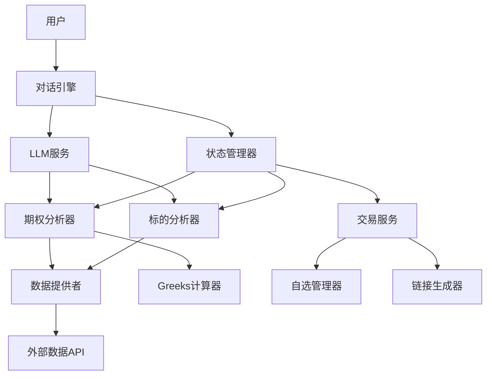

# 设计文档

## 概述

期权交易工具是一个对话式的交易辅助系统，通过自然语言交互帮助用户完成从标的选择、市场分析、期权合约筛选到交易执行的完整流程。系统专注于Long Call和Long Put两种基础期权策略，通过LLM驱动的分析引擎提供智能化的交易建议。

### 核心功能

- 对话式标的选择和验证
- LLM驱动的市场情绪分析
- 期权合约智能筛选和排序
- 一键交易入口和自选管理
- 完整的对话上下文维护

### 技术栈

- **对话框架**: 状态机驱动的多轮对话管理
- **LLM集成**: 用于市场分析和自然语言生成
- **数据源**: 实时期权数据API（如Yahoo Finance、Alpha Vantage或专业期权数据提供商）
- **计算引擎**: 期权Greeks计算库
- **存储**: 用户会话状态和自选列表持久化

## 架构

### 系统架构图



### 架构层次

1. **交互层（Interaction Layer）**
   - 对话引擎：处理用户输入，生成自然语言响应
   - 状态管理器：维护对话状态和流程控制

2. **业务逻辑层（Business Logic Layer）**
   - 标的分析器：验证标的、获取价格数据、调用LLM分析
   - 期权分析器：获取期权链、计算Greeks、筛选排序合约
   - 交易服务：生成交易链接、管理自选列表

3. **数据层（Data Layer）**
   - 数据提供者：统一的数据访问接口
   - Greeks计算器：期权指标计算
   - 自选管理器：持久化用户自选列表

4. **外部集成层（External Integration Layer）**
   - LLM服务：市场分析和自然语言生成
   - 外部数据API：实时市场数据获取

## 组件和接口

### 1. 对话引擎（DialogEngine）

负责管理整个对话流程，协调各个分析组件。

```typescript
interface DialogEngine {
  // 启动新会话
  startSession(): SessionId
  
  // 处理用户输入
  processInput(sessionId: SessionId, userInput: string): DialogResponse
  
  // 获取当前对话状态
  getSessionState(sessionId: SessionId): SessionState
  
  // 重置会话
  resetSession(sessionId: SessionId): void
}

interface DialogResponse {
  message: string              // 系统回复消息
  state: DialogState           // 当前对话状态
  options?: string[]           // 可选的快捷选项
  data?: any                   // 附加数据（如分析结果）
}

enum DialogState {
  AWAITING_UNDERLYING,         // 等待标的输入
  CONFIRMING_UNDERLYING,       // 确认标的信息
  ANALYZING_UNDERLYING,        // 分析标的中
  SUGGESTING_STRATEGY,         // 建议策略
  ANALYZING_OPTIONS,           // 分析期权合约
  PRESENTING_CONTRACTS,        // 展示合约列表
  AWAITING_SELECTION,          // 等待用户选择
  GENERATING_TRADE_LINK,       // 生成交易链接
  COMPLETED                    // 流程完成
}
```

### 2. 状态管理器（StateManager）

维护会话状态和对话上下文。

```typescript
interface StateManager {
  // 创建新会话
  createSession(): SessionId
  
  // 更新会话状态
  updateState(sessionId: SessionId, state: SessionState): void
  
  // 获取会话状态
  getState(sessionId: SessionId): SessionState | null
  
  // 删除会话
  deleteSession(sessionId: SessionId): void
  
  // 保存对话历史
  appendHistory(sessionId: SessionId, entry: DialogHistoryEntry): void
}

interface SessionState {
  sessionId: SessionId
  currentState: DialogState
  underlying?: UnderlyingAsset
  sentiment?: MarketSentiment
  strategy?: StrategyType
  analyzedContracts?: OptionContract[]
  selectedContracts?: OptionContract[]
  history: DialogHistoryEntry[]
  createdAt: Date
  updatedAt: Date
}
```

### 3. 标的分析器（UnderlyingAnalyzer）

验证和分析底层标的资产。

```typescript
interface UnderlyingAnalyzer {
  // 验证标的是否存在且支持期权
  validateUnderlying(input: string): ValidationResult
  
  // 获取标的基本信息
  getUnderlyingInfo(symbol: string): UnderlyingAsset
  
  // 分析标的市场情绪
  analyzeMarketSentiment(symbol: string): MarketAnalysis
}

interface ValidationResult {
  isValid: boolean
  symbol?: string              // 标准化的标的代码
  name?: string                // 标的名称
  error?: string               // 错误信息
}

interface MarketAnalysis {
  sentiment: MarketSentiment   // 市场情绪
  volatility: number           // 波动率
  trend: TrendDirection        // 趋势方向
  supportLevel?: number        // 支撑位
  resistanceLevel?: number     // 阻力位
  analysis: string             // LLM生成的分析说明
  suggestedStrategy: StrategyType
}

enum MarketSentiment {
  BULLISH = "看涨",
  BEARISH = "看跌",
  NEUTRAL = "中性"
}

enum TrendDirection {
  UPTREND = "上升趋势",
  DOWNTREND = "下降趋势",
  SIDEWAYS = "横盘整理"
}

enum StrategyType {
  LONG_CALL = "Long Call",
  LONG_PUT = "Long Put"
}
```

### 4. 期权分析器（OptionAnalyzer）

获取和分析期权合约。

```typescript
interface OptionAnalyzer {
  // 获取期权链
  getOptionChain(symbol: string, strategy: StrategyType): OptionContract[]
  
  // 分析期权合约
  analyzeContracts(
    contracts: OptionContract[],
    underlying: UnderlyingAsset,
    sentiment: MarketSentiment
  ): AnalyzedContract[]
  
  // 排序合约
  rankContracts(contracts: AnalyzedContract[]): AnalyzedContract[]
}

interface OptionContract {
  contractSymbol: string       // 合约代码
  strike: number               // 行权价
  expiration: Date             // 到期日
  premium: number              // 权利金
  impliedVolatility: number    // 隐含波动率
  delta: number                // Delta值
  gamma?: number               // Gamma值
  theta?: number               // Theta值
  vega?: number                // Vega值
  volume: number               // 成交量
  openInterest: number         // 持仓量
  type: OptionType             // 期权类型
}

enum OptionType {
  CALL = "看涨期权",
  PUT = "看跌期权"
}

interface AnalyzedContract extends OptionContract {
  score: number                // 推荐评分
  analysis: string             // LLM生成的分析说明
  riskLevel: RiskLevel         // 风险等级
}

enum RiskLevel {
  LOW = "低风险",
  MEDIUM = "中等风险",
  HIGH = "高风险"
}
```

### 5. 交易服务（TradeService）

生成交易链接和管理自选列表。

```typescript
interface TradeService {
  // 生成交易链接
  generateTradeLink(contract: OptionContract): string
  
  // 添加到自选
  addToWatchlist(userId: string, contracts: OptionContract[]): WatchlistResult
  
  // 获取自选列表
  getWatchlist(userId: string): OptionContract[]
  
  // 从自选移除
  removeFromWatchlist(userId: string, contractSymbol: string): boolean
}

interface WatchlistResult {
  success: boolean
  addedCount: number
  failedContracts?: string[]
  message: string
}
```

### 6. 数据提供者（DataProvider）

统一的数据访问接口，封装外部API调用。

```typescript
interface DataProvider {
  // 搜索标的
  searchUnderlying(query: string): UnderlyingAsset[]
  
  // 获取标的当前价格
  getCurrentPrice(symbol: string): PriceData
  
  // 获取历史价格
  getHistoricalPrices(symbol: string, period: TimePeriod): PriceData[]
  
  // 获取期权链
  getOptionChain(symbol: string, optionType?: OptionType): OptionContract[]
  
  // 检查标的是否支持期权
  supportsOptions(symbol: string): boolean
}

interface PriceData {
  symbol: string
  price: number
  timestamp: Date
  change: number
  changePercent: number
}

enum TimePeriod {
  ONE_DAY = "1d",
  ONE_WEEK = "1w",
  ONE_MONTH = "1m",
  THREE_MONTHS = "3m",
  ONE_YEAR = "1y"
}
```

### 7. LLM服务（LLMService）

封装LLM调用，用于市场分析和自然语言生成。

```typescript
interface LLMService {
  // 分析标的市场情绪
  analyzeSentiment(
    underlying: UnderlyingAsset,
    priceHistory: PriceData[],
    technicalIndicators: TechnicalIndicators
  ): SentimentAnalysis
  
  // 分析期权合约
  analyzeOptionContract(
    contract: OptionContract,
    underlying: UnderlyingAsset,
    sentiment: MarketSentiment
  ): ContractAnalysis
  
  // 生成对话响应
  generateResponse(
    context: SessionState,
    intent: UserIntent
  ): string
}

interface SentimentAnalysis {
  sentiment: MarketSentiment
  confidence: number           // 0-1之间的置信度
  reasoning: string            // 分析理由
  suggestedStrategy: StrategyType
}

interface ContractAnalysis {
  score: number                // 0-100的推荐评分
  reasoning: string            // 推荐理由
  riskLevel: RiskLevel
  keyPoints: string[]          // 关键要点
}
```

### 8. Greeks计算器（GreeksCalculator）

计算期权的Greeks指标。

```typescript
interface GreeksCalculator {
  // 计算所有Greeks
  calculateGreeks(
    optionType: OptionType,
    spotPrice: number,
    strike: number,
    timeToExpiry: number,
    volatility: number,
    riskFreeRate: number
  ): Greeks
  
  // 计算单个指标
  calculateDelta(params: GreeksParams): number
  calculateGamma(params: GreeksParams): number
  calculateTheta(params: GreeksParams): number
  calculateVega(params: GreeksParams): number
}

interface Greeks {
  delta: number
  gamma: number
  theta: number
  vega: number
  rho?: number
}
```

## 数据模型

### 核心实体

#### UnderlyingAsset（底层标的）

```typescript
interface UnderlyingAsset {
  symbol: string               // 标的代码（如"AAPL"）
  name: string                 // 标的名称
  nameCn?: string              // 中文名称
  currentPrice: number         // 当前价格
  priceTimestamp: Date         // 价格时间戳
  change: number               // 价格变动
  changePercent: number        // 变动百分比
  supportsOptions: boolean     // 是否支持期权交易
}
```

#### OptionContract（期权合约）

```typescript
interface OptionContract {
  contractSymbol: string       // 合约唯一标识
  underlyingSymbol: string     // 底层标的代码
  type: OptionType             // CALL或PUT
  strike: number               // 行权价
  expiration: Date             // 到期日
  daysToExpiry: number         // 距离到期天数
  
  // 价格信息
  premium: number              // 权利金（最新价）
  bid: number                  // 买价
  ask: number                  // 卖价
  
  // Greeks
  delta: number
  gamma?: number
  theta?: number
  vega?: number
  
  // 市场数据
  impliedVolatility: number    // 隐含波动率
  volume: number               // 成交量
  openInterest: number         // 持仓量
  
  // 元数据
  lastUpdate: Date             // 最后更新时间
}
```

#### AnalyzedContract（分析后的合约）

```typescript
interface AnalyzedContract extends OptionContract {
  score: number                // 推荐评分（0-100）
  riskLevel: RiskLevel         // 风险等级
  analysis: string             // LLM生成的分析
  keyMetrics: {
    moneyness: Moneyness       // 实值/平值/虚值
    liquidityScore: number     // 流动性评分
    costEfficiency: number     // 成本效率
  }
}

enum Moneyness {
  ITM = "实值",                // In The Money
  ATM = "平值",                // At The Money
  OTM = "虚值"                 // Out of The Money
}
```

#### SessionState（会话状态）

```typescript
interface SessionState {
  sessionId: string
  userId?: string
  currentState: DialogState
  
  // 流程数据
  underlying?: UnderlyingAsset
  marketAnalysis?: MarketAnalysis
  strategy?: StrategyType
  analyzedContracts?: AnalyzedContract[]
  selectedContracts?: OptionContract[]
  
  // 对话历史
  history: DialogHistoryEntry[]
  
  // 时间戳
  createdAt: Date
  updatedAt: Date
}

interface DialogHistoryEntry {
  timestamp: Date
  role: "user" | "system"
  content: string
  state: DialogState
}
```

#### TechnicalIndicators（技术指标）

```typescript
interface TechnicalIndicators {
  volatility: number           // 历史波动率
  trend: TrendDirection        // 趋势方向
  supportLevel?: number        // 支撑位
  resistanceLevel?: number     // 阻力位
  rsi?: number                 // 相对强弱指标
  movingAverage?: {
    ma20: number
    ma50: number
    ma200: number
  }
}
```

### 数据流

1. **标的选择流程**
   ```
   用户输入 → 对话引擎 → 标的分析器.validateUnderlying()
   → 数据提供者.searchUnderlying() → 返回验证结果
   ```

2. **市场分析流程**
   ```
   标的代码 → 标的分析器.analyzeMarketSentiment()
   → 数据提供者.getHistoricalPrices()
   → LLM服务.analyzeSentiment() → 返回市场分析
   ```

3. **期权筛选流程**
   ```
   标的+策略 → 期权分析器.getOptionChain()
   → 数据提供者.getOptionChain()
   → Greeks计算器.calculateGreeks()
   → LLM服务.analyzeOptionContract()
   → 期权分析器.rankContracts() → 返回排序后的合约列表
   ```

4. **交易入口流程**
   ```
   选中合约 → 交易服务.generateTradeLink() → 返回交易链接
   选中合约 → 交易服务.addToWatchlist() → 保存到自选列表
   ```


## 正确性属性

*属性是指在系统所有有效执行中都应该成立的特征或行为——本质上是关于系统应该做什么的形式化陈述。属性是人类可读规范和机器可验证正确性保证之间的桥梁。*

### 属性 1: 标的验证的完整性

*对于任何*用户输入的标的标识（代码或名称），系统的验证结果应该正确反映该标的是否存在且支持期权交易，并且当标的无效时，验证结果应包含明确的错误原因说明。

**验证需求: 1.2, 1.3**

### 属性 2: 多格式输入的等价性

*对于任何*有效的底层标的，无论用户使用股票代码、中文名称还是英文名称作为输入，系统最终识别的标的应该是同一个（即返回相同的标准化symbol）。

**验证需求: 1.5**

### 属性 3: 有效标的信息的完整性

*对于任何*验证成功的标的，系统返回的标的信息应该包含所有必需字段：标的名称、当前价格、标的代码，且这些字段都不应为空。

**验证需求: 1.4**

### 属性 4: 市场分析结果的完整性

*对于任何*有效的底层标的，标的分析器返回的市场分析结果应该包含所有必需的字段：技术指标（波动率、趋势方向、支撑位、阻力位）、市场情绪（看涨/看跌/中性之一）、分析说明文本，且关键字段不应为空。

**验证需求: 2.1, 2.2, 2.3, 2.4**

### 属性 5: 市场情绪与策略建议的映射

*对于任何*市场分析结果，当市场情绪为"看涨"时，建议的策略应该是Long Call；当市场情绪为"看跌"时，建议的策略应该是Long Put。

**验证需求: 2.6**

### 属性 6: 期权合约类型筛选的正确性

*对于任何*标的和策略类型组合，当策略为Long Call时，期权分析器返回的所有合约类型都应该是CALL；当策略为Long Put时，返回的所有合约类型都应该是PUT。

**验证需求: 3.2**

### 属性 7: 期权合约数据的完整性

*对于任何*期权分析器返回的合约，该合约应该包含所有必需的关键指标字段：行权价、到期日、权利金、隐含波动率、Delta值，且这些字段都应该是有效的数值。

**验证需求: 3.3**

### 属性 8: 合约列表的排序性

*对于任何*期权分析器返回的合约列表，列表应该按照推荐评分（score字段）降序排列，即列表中任意相邻的两个合约，前一个的score应该大于或等于后一个的score。

**验证需求: 3.4**

### 属性 9: 合约选择的灵活性

*对于任何*有效的合约列表，系统应该能够正确处理用户选择单个合约或多个合约的情况，并为所有选中的合约生成对应的交易链接。

**验证需求: 3.7, 4.6**

### 属性 10: 交易链接生成的完整性

*对于任何*用户选中的有效期权合约，系统应该为该合约生成一个非空的交易链接字符串，且该链接应该包含合约的唯一标识信息。

**验证需求: 4.1**

### 属性 11: 自选列表的往返一致性

*对于任何*有效的期权合约，当用户将其添加到自选列表后，立即查询该用户的自选列表应该包含刚才添加的合约（通过contractSymbol匹配），且添加操作应该返回成功确认。

**验证需求: 4.3, 4.4**

### 属性 12: 对话上下文的持久性

*对于任何*会话，在经过多轮对话交互后（包括标的选择、市场分析、合约筛选等步骤），系统应该仍然能够访问之前步骤中保存的所有关键信息（如选定的标的、市场情绪、策略类型）。

**验证需求: 5.1**

### 属性 13: 会话重置的彻底性

*对于任何*处于任意状态的会话，当用户请求重新开始时，系统应该将会话状态重置为初始状态（AWAITING_UNDERLYING），并清除所有之前保存的业务数据（标的、分析结果、选中合约等）。

**验证需求: 5.4**

### 属性 14: 数据时间戳的完整性

*对于任何*系统返回的价格数据或分析结果，数据对象应该包含时间戳字段（timestamp或lastUpdate），标注数据的更新时间或生成时间。

**验证需求: 6.2, 6.5**

### 属性 15: 数据时效性的保证

*对于任何*系统返回的市场数据（价格、期权链等），数据的时间戳与当前系统时间的差值应该不超过15分钟（900秒）。

**验证需求: 6.3**

### 属性 16: 数据获取失败的错误处理

*对于任何*数据获取操作，当数据源不可用或获取失败时，系统应该返回包含错误信息的结果对象，且错误信息应该说明失败的原因，而不是抛出未捕获的异常或返回空值。

**验证需求: 6.4**

## 错误处理

### 错误分类

系统错误分为以下几类：

1. **输入验证错误（Validation Errors）**
   - 标的不存在
   - 标的不支持期权交易
   - 无效的合约标识
   - 空输入或格式错误

2. **数据获取错误（Data Errors）**
   - 外部API不可用
   - API请求超时
   - API返回错误响应
   - 数据解析失败

3. **业务逻辑错误（Business Logic Errors）**
   - 会话不存在或已过期
   - 状态转换不合法
   - 操作不允许（如在错误的状态下执行某操作）

4. **系统错误（System Errors）**
   - LLM服务不可用
   - 数据库连接失败
   - 内部计算错误

### 错误处理策略

#### 1. 输入验证错误

```typescript
// 策略：立即返回友好的错误提示，引导用户重新输入
interface ValidationError {
  type: "VALIDATION_ERROR"
  field: string
  message: string
  suggestions?: string[]  // 可选的建议
}

// 示例
{
  type: "VALIDATION_ERROR",
  field: "underlying",
  message: "未找到标的 'APPL'，您是否想输入 'AAPL'？",
  suggestions: ["AAPL", "APLT"]
}
```

#### 2. 数据获取错误

```typescript
// 策略：重试机制 + 降级处理 + 用户通知
interface DataError {
  type: "DATA_ERROR"
  source: string
  message: string
  retryable: boolean
  fallbackAvailable: boolean
}

// 重试配置
const RETRY_CONFIG = {
  maxRetries: 3,
  retryDelay: 1000,  // 1秒
  backoffMultiplier: 2
}

// 降级策略
// - 如果实时数据不可用，使用缓存数据（标注为延迟数据）
// - 如果主数据源失败，尝试备用数据源
// - 如果所有数据源都失败，通知用户并建议稍后重试
```

#### 3. 业务逻辑错误

```typescript
// 策略：状态检查 + 清晰的错误消息
interface BusinessLogicError {
  type: "BUSINESS_LOGIC_ERROR"
  code: string
  message: string
  currentState?: DialogState
  allowedActions?: string[]
}

// 示例：在错误的状态下尝试选择合约
{
  type: "BUSINESS_LOGIC_ERROR",
  code: "INVALID_STATE_TRANSITION",
  message: "请先完成标的分析后再选择期权合约",
  currentState: "AWAITING_UNDERLYING",
  allowedActions: ["输入标的代码", "查看帮助"]
}
```

#### 4. 系统错误

```typescript
// 策略：日志记录 + 通用错误消息 + 降级服务
interface SystemError {
  type: "SYSTEM_ERROR"
  code: string
  message: string  // 用户友好的消息
  internalMessage: string  // 内部日志消息
  timestamp: Date
}

// 降级服务
// - LLM不可用时，使用基于规则的简化分析
// - 数据库不可用时，使用内存存储（会话级别）
```

### 错误响应格式

所有错误都通过统一的错误响应格式返回：

```typescript
interface ErrorResponse {
  success: false
  error: ValidationError | DataError | BusinessLogicError | SystemError
  requestId: string  // 用于追踪和调试
  timestamp: Date
}
```

### 错误恢复机制

1. **自动重试**: 对于临时性的网络错误和API限流，自动重试
2. **数据缓存**: 缓存最近的市场数据，在数据源不可用时提供降级服务
3. **会话恢复**: 保存会话状态，允许用户在错误后继续之前的流程
4. **优雅降级**: 在部分功能不可用时，提供简化版本的服务

### 日志和监控

```typescript
interface ErrorLog {
  level: "ERROR" | "WARN"
  type: string
  message: string
  stack?: string
  context: {
    sessionId?: string
    userId?: string
    operation: string
    input?: any
  }
  timestamp: Date
}

// 关键监控指标
// - API错误率
// - LLM服务可用性
// - 平均响应时间
// - 会话成功完成率
```

## 测试策略

### 测试方法概述

本系统采用**双重测试方法**，结合单元测试和基于属性的测试（Property-Based Testing, PBT），以确保全面的代码覆盖和正确性验证。

- **单元测试**: 验证特定示例、边缘情况和错误条件
- **属性测试**: 通过随机生成大量输入，验证系统在所有情况下都满足的通用属性

两种测试方法是互补的：单元测试捕获具体的bug和已知的边缘情况，属性测试验证系统的通用正确性并发现未预期的问题。

### 基于属性的测试配置

**测试库选择**: 根据实现语言选择合适的PBT库
- TypeScript/JavaScript: `fast-check`
- Python: `hypothesis`
- Java: `jqwik`
- Go: `gopter`

**测试配置要求**:
- 每个属性测试至少运行 **100次迭代**（由于随机化特性）
- 每个测试必须通过注释标签引用设计文档中的属性
- 标签格式: `Feature: options-trading-tool, Property {number}: {property_text}`

**示例配置** (使用fast-check):

```typescript
import fc from 'fast-check';

describe('Property Tests for Options Trading Tool', () => {
  
  // Feature: options-trading-tool, Property 1: 标的验证的完整性
  it('should validate underlying assets correctly for all inputs', () => {
    fc.assert(
      fc.property(
        fc.string(), // 生成随机字符串作为标的输入
        async (input) => {
          const result = await underlyingAnalyzer.validateUnderlying(input);
          
          // 验证结果结构完整
          expect(result).toHaveProperty('isValid');
          
          // 如果无效，必须有错误信息
          if (!result.isValid) {
            expect(result.error).toBeDefined();
            expect(result.error).not.toBe('');
          }
          
          // 如果有效，必须有标准化的symbol
          if (result.isValid) {
            expect(result.symbol).toBeDefined();
            expect(result.name).toBeDefined();
          }
        }
      ),
      { numRuns: 100 }
    );
  });
  
  // Feature: options-trading-tool, Property 6: 期权合约类型筛选的正确性
  it('should filter option contracts by strategy type correctly', () => {
    fc.assert(
      fc.property(
        fc.constantFrom('AAPL', 'TSLA', 'MSFT'), // 有效标的
        fc.constantFrom(StrategyType.LONG_CALL, StrategyType.LONG_PUT),
        async (symbol, strategy) => {
          const contracts = await optionAnalyzer.getOptionChain(symbol, strategy);
          
          // 验证所有合约类型匹配策略
          const expectedType = strategy === StrategyType.LONG_CALL 
            ? OptionType.CALL 
            : OptionType.PUT;
          
          contracts.forEach(contract => {
            expect(contract.type).toBe(expectedType);
          });
        }
      ),
      { numRuns: 100 }
    );
  });
  
  // Feature: options-trading-tool, Property 8: 合约列表的排序性
  it('should return contracts sorted by score in descending order', () => {
    fc.assert(
      fc.property(
        fc.constantFrom('AAPL', 'TSLA', 'MSFT'),
        fc.constantFrom(StrategyType.LONG_CALL, StrategyType.LONG_PUT),
        async (symbol, strategy) => {
          const contracts = await optionAnalyzer.getOptionChain(symbol, strategy);
          const ranked = await optionAnalyzer.rankContracts(contracts);
          
          // 验证排序：每个元素的score >= 下一个元素的score
          for (let i = 0; i < ranked.length - 1; i++) {
            expect(ranked[i].score).toBeGreaterThanOrEqual(ranked[i + 1].score);
          }
        }
      ),
      { numRuns: 100 }
    );
  });
  
  // Feature: options-trading-tool, Property 11: 自选列表的往返一致性
  it('should maintain watchlist consistency after add operation', () => {
    fc.assert(
      fc.property(
        fc.string({ minLength: 1 }), // userId
        fc.array(generateValidContract(), { minLength: 1, maxLength: 5 }), // contracts
        async (userId, contracts) => {
          // 添加到自选
          const addResult = await tradeService.addToWatchlist(userId, contracts);
          expect(addResult.success).toBe(true);
          
          // 查询自选列表
          const watchlist = await tradeService.getWatchlist(userId);
          
          // 验证所有添加的合约都在列表中
          contracts.forEach(contract => {
            const found = watchlist.find(
              item => item.contractSymbol === contract.contractSymbol
            );
            expect(found).toBeDefined();
          });
        }
      ),
      { numRuns: 100 }
    );
  });
  
});

// 辅助函数：生成有效的期权合约
function generateValidContract(): fc.Arbitrary<OptionContract> {
  return fc.record({
    contractSymbol: fc.string({ minLength: 10, maxLength: 20 }),
    underlyingSymbol: fc.constantFrom('AAPL', 'TSLA', 'MSFT'),
    type: fc.constantFrom(OptionType.CALL, OptionType.PUT),
    strike: fc.double({ min: 50, max: 500 }),
    expiration: fc.date({ min: new Date() }),
    premium: fc.double({ min: 0.01, max: 100 }),
    delta: fc.double({ min: -1, max: 1 }),
    impliedVolatility: fc.double({ min: 0.1, max: 2.0 }),
    volume: fc.integer({ min: 0, max: 100000 }),
    openInterest: fc.integer({ min: 0, max: 100000 })
  });
}
```

### 单元测试策略

单元测试专注于以下方面：

#### 1. 具体示例测试

```typescript
describe('UnderlyingAnalyzer - Specific Examples', () => {
  
  it('should recognize AAPL by stock code', async () => {
    const result = await underlyingAnalyzer.validateUnderlying('AAPL');
    expect(result.isValid).toBe(true);
    expect(result.symbol).toBe('AAPL');
    expect(result.name).toContain('Apple');
  });
  
  it('should recognize Apple by Chinese name', async () => {
    const result = await underlyingAnalyzer.validateUnderlying('苹果');
    expect(result.isValid).toBe(true);
    expect(result.symbol).toBe('AAPL');
  });
  
  it('should suggest correct symbol for typo', async () => {
    const result = await underlyingAnalyzer.validateUnderlying('APPL');
    expect(result.isValid).toBe(false);
    expect(result.suggestions).toContain('AAPL');
  });
  
});
```

#### 2. 边缘情况测试

```typescript
describe('Edge Cases', () => {
  
  it('should handle empty input', async () => {
    const result = await underlyingAnalyzer.validateUnderlying('');
    expect(result.isValid).toBe(false);
    expect(result.error).toBeDefined();
  });
  
  it('should handle whitespace-only input', async () => {
    const result = await underlyingAnalyzer.validateUnderlying('   ');
    expect(result.isValid).toBe(false);
  });
  
  it('should handle very long input', async () => {
    const longInput = 'A'.repeat(1000);
    const result = await underlyingAnalyzer.validateUnderlying(longInput);
    expect(result.isValid).toBe(false);
  });
  
  it('should handle special characters', async () => {
    const result = await underlyingAnalyzer.validateUnderlying('$@#%');
    expect(result.isValid).toBe(false);
  });
  
  it('should handle contracts with zero volume', async () => {
    const contract = { ...validContract, volume: 0 };
    const analyzed = await optionAnalyzer.analyzeContracts([contract]);
    expect(analyzed[0].riskLevel).toBe(RiskLevel.HIGH); // 低流动性=高风险
  });
  
  it('should handle contracts expiring today', async () => {
    const today = new Date();
    const contract = { ...validContract, expiration: today };
    const analyzed = await optionAnalyzer.analyzeContracts([contract]);
    expect(analyzed[0].daysToExpiry).toBe(0);
  });
  
});
```

#### 3. 错误条件测试

```typescript
describe('Error Handling', () => {
  
  it('should handle API timeout gracefully', async () => {
    // Mock API timeout
    jest.spyOn(dataProvider, 'getCurrentPrice')
      .mockRejectedValue(new Error('Timeout'));
    
    const result = await underlyingAnalyzer.getUnderlyingInfo('AAPL');
    expect(result.error).toBeDefined();
    expect(result.error.type).toBe('DATA_ERROR');
  });
  
  it('should handle LLM service unavailable', async () => {
    jest.spyOn(llmService, 'analyzeSentiment')
      .mockRejectedValue(new Error('Service unavailable'));
    
    const result = await underlyingAnalyzer.analyzeMarketSentiment('AAPL');
    // 应该降级到基于规则的分析
    expect(result).toBeDefined();
    expect(result.sentiment).toBeDefined();
  });
  
  it('should handle invalid session ID', async () => {
    const result = await dialogEngine.getSessionState('invalid-session-id');
    expect(result).toBeNull();
  });
  
  it('should handle data source returning empty option chain', async () => {
    jest.spyOn(dataProvider, 'getOptionChain').mockResolvedValue([]);
    
    const contracts = await optionAnalyzer.getOptionChain('AAPL', StrategyType.LONG_CALL);
    expect(contracts).toEqual([]);
    // 系统应该通知用户没有可用合约
  });
  
});
```

#### 4. 集成点测试

```typescript
describe('Integration Points', () => {
  
  it('should complete full workflow from underlying to trade link', async () => {
    // 1. 启动会话
    const sessionId = dialogEngine.startSession();
    
    // 2. 输入标的
    const response1 = await dialogEngine.processInput(sessionId, 'AAPL');
    expect(response1.state).toBe(DialogState.CONFIRMING_UNDERLYING);
    
    // 3. 确认并分析
    const response2 = await dialogEngine.processInput(sessionId, '确认');
    expect(response2.state).toBe(DialogState.SUGGESTING_STRATEGY);
    
    // 4. 选择策略
    const response3 = await dialogEngine.processInput(sessionId, 'Long Call');
    expect(response3.state).toBe(DialogState.PRESENTING_CONTRACTS);
    
    // 5. 选择合约
    const response4 = await dialogEngine.processInput(sessionId, '选择第1个');
    expect(response4.state).toBe(DialogState.GENERATING_TRADE_LINK);
    expect(response4.data.tradeLink).toBeDefined();
  });
  
  it('should maintain context across multiple interactions', async () => {
    const sessionId = dialogEngine.startSession();
    
    await dialogEngine.processInput(sessionId, 'AAPL');
    await dialogEngine.processInput(sessionId, '确认');
    
    const state = await dialogEngine.getSessionState(sessionId);
    expect(state.underlying.symbol).toBe('AAPL');
    expect(state.history.length).toBeGreaterThan(0);
  });
  
});
```

### 测试覆盖率目标

- **代码覆盖率**: 最低80%，核心业务逻辑90%以上
- **属性测试覆盖**: 所有16个正确性属性都必须有对应的属性测试
- **边缘情况覆盖**: 每个公共API至少包含3个边缘情况测试
- **错误路径覆盖**: 所有错误类型都必须有测试覆盖

### 测试数据管理

```typescript
// 使用测试数据工厂
class TestDataFactory {
  static createValidUnderlying(overrides?: Partial<UnderlyingAsset>): UnderlyingAsset {
    return {
      symbol: 'AAPL',
      name: 'Apple Inc.',
      nameCn: '苹果公司',
      currentPrice: 150.00,
      priceTimestamp: new Date(),
      change: 2.50,
      changePercent: 1.69,
      supportsOptions: true,
      ...overrides
    };
  }
  
  static createValidContract(overrides?: Partial<OptionContract>): OptionContract {
    return {
      contractSymbol: 'AAPL240119C00150000',
      underlyingSymbol: 'AAPL',
      type: OptionType.CALL,
      strike: 150,
      expiration: new Date('2024-01-19'),
      daysToExpiry: 30,
      premium: 5.50,
      bid: 5.45,
      ask: 5.55,
      delta: 0.52,
      impliedVolatility: 0.25,
      volume: 1000,
      openInterest: 5000,
      lastUpdate: new Date(),
      ...overrides
    };
  }
}

// Mock数据提供者
class MockDataProvider implements DataProvider {
  private mockData: Map<string, any> = new Map();
  
  setMockData(key: string, data: any) {
    this.mockData.set(key, data);
  }
  
  async getCurrentPrice(symbol: string): Promise<PriceData> {
    return this.mockData.get(`price_${symbol}`) || TestDataFactory.createValidPrice();
  }
  
  // ... 其他mock方法
}
```

### 持续集成测试

```yaml
# CI配置示例
test:
  unit-tests:
    - run: npm test -- --coverage
    - coverage-threshold: 80%
  
  property-tests:
    - run: npm test -- --testPathPattern=property
    - min-iterations: 100
  
  integration-tests:
    - run: npm test -- --testPathPattern=integration
    - requires: [mock-api-server]
  
  performance-tests:
    - run: npm run test:perf
    - max-response-time: 2000ms
```

### 测试优先级

1. **P0 - 关键路径**: 标的验证、市场分析、合约筛选、交易链接生成
2. **P1 - 核心功能**: 对话流程、状态管理、错误处理
3. **P2 - 辅助功能**: 自选管理、格式化输出、日志记录

所有P0和P1功能必须有完整的单元测试和属性测试覆盖。
