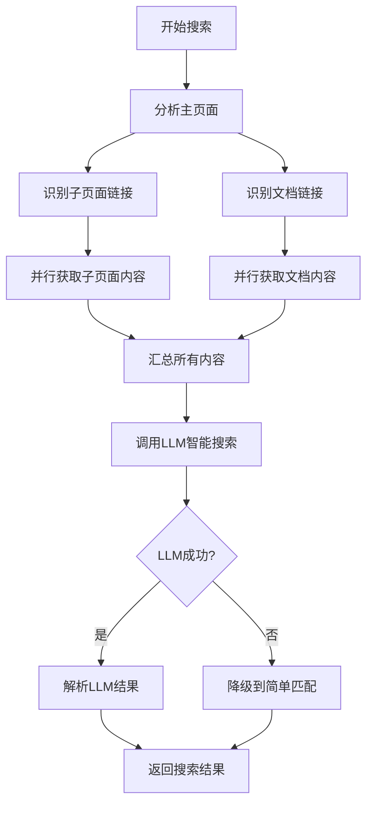

# 搜索功能升级总结

## 问题分析

### 原始问题
用户反馈：搜索任务检索结果为0，但已确认目标网页中含有搜索关键词，关键词在子网页的文件中。

### 根本原因
原有的搜索逻辑存在以下局限：

1. **只搜索主页面**：只获取和搜索目标网站的主页面内容
2. **不搜索子页面**：虽然WebsiteAnalyzer能识别子页面链接，但ContentRetriever不会去获取这些子页面的内容
3. **不搜索文档**：虽然能识别PDF、DOC等文档链接，但不会深入搜索文档内容
4. **简单字符串匹配**：使用正则表达式进行简单的关键词匹配，无法理解语义

## 解决方案

### 核心改进：LLM智能搜索

将搜索逻辑从"简单关键词匹配"升级为"LLM智能搜索"：

#### 1. 扩大搜索范围
```
原来：只搜索主页面
现在：主页面 + 子页面（前5个）+ 文档（前5个）
```

#### 2. 智能内容提取
```
原来：正则表达式匹配关键词
现在：LLM理解内容，提取完整定义和解释
```

#### 3. 准确的来源追踪
```
原来：只知道在哪个网站找到
现在：精确到具体的子页面或文档URL
```

## 技术实现

### 修改的文件

1. **backend/src/services/ContentRetriever.ts**
   - 添加LLM API配置参数
   - 新增 `fetchSubPages()` 方法：并行获取子页面内容
   - 新增 `fetchDocuments()` 方法：并行获取文档内容
   - 新增 `llmWebSearch()` 方法：使用LLM进行智能搜索
   - 新增 `buildLLMSearchPrompt()` 方法：构建LLM搜索提示词
   - 新增 `parseLLMSearchResponse()` 方法：解析LLM返回结果
   - 新增 `fallbackKeywordSearch()` 方法：LLM失败时的降级方案
   - 新增 `callLLM()` 方法：调用LLM API

2. **backend/package.json**
   - 已包含所需依赖（axios、jsdom）

### 新的搜索流程



### LLM提示词工程

系统使用精心设计的提示词，指导LLM：

1. **角色定位**：专业的网页内容检索助手
2. **任务说明**：在指定网站内容中搜索关键词
3. **内容提供**：主页面 + 子页面 + 文档内容
4. **输出格式**：结构化JSON，包含关键词、是否找到、定义、来源URL、上下文
5. **质量要求**：选择最详细、最权威的内容

### 示例提示词

```
你是一个专业的网页内容检索助手。请在以下网站内容中搜索指定的关键词，并提取相关信息。

目标网站: https://www.nyse.com
搜索关键词: professional subscriber

## 主页面内容:
[主页面HTML内容...]

## 子页面内容:
### 子页面 1 (https://www.nyse.com/market-data):
[子页面内容...]

## 文档内容:
### 文档 1 (https://www.nyse.com/.../Agreement.pdf):
[文档内容...]

请以JSON格式返回搜索结果...
```

## 配置说明

### 环境变量

在 `.env` 文件中配置LLM API：

```bash
# OpenAI API (默认)
LLM_API_KEY=sk-...
LLM_API_URL=https://api.openai.com/v1/chat/completions
LLM_MODEL=gpt-4

# 或使用其他兼容OpenAI格式的服务
LLM_API_KEY=your_key
LLM_API_URL=https://your-llm-service.com/v1/chat/completions
LLM_MODEL=your-model
LLM_API_KEY_HEADER=Authorization
LLM_AUTH_PREFIX=Bearer
```

### 性能参数

可以通过修改 `ContentRetriever.ts` 调整：

```typescript
// 子页面数量限制
analysisResult.pageLinks.slice(0, 5)  // 改为其他数字

// 文档数量限制
analysisResult.documentLinks.slice(0, 5)  // 改为其他数字

// 内容长度限制
mainPageContent.substring(0, 5000)  // 主页面
pageContent.substring(0, 3000)      // 子页面
docContent.substring(0, 3000)       // 文档
```

## 测试验证

### 测试场景

使用之前失败的搜索任务进行测试：

```
网站: https://www.nyse.com
关键词: professional subscriber
```

### 预期结果

1. ✅ 系统会分析主页面，识别子页面和文档链接
2. ✅ 系统会获取相关子页面和文档内容
3. ✅ LLM会在文档中找到 "professional subscriber" 的定义
4. ✅ 返回结果包含完整定义和准确的文档URL
5. ✅ 检索结果不再为0

### 验证步骤

1. 重启后端服务（已完成）
2. 创建新的搜索任务或重新执行现有任务
3. 查看执行日志，确认：
   - 发现了子页面和文档链接
   - 成功获取了内容
   - LLM搜索完成
   - 找到了关键词
4. 查看搜索结果，确认：
   - found = true
   - content 包含完整定义
   - sourceUrl 指向具体文档或子页面

## 优势总结

### 1. 解决了原始问题
- ✅ 能搜索子页面内容
- ✅ 能搜索文档内容
- ✅ 不会因为关键词在子页面/文档中而漏掉

### 2. 提升了搜索质量
- ✅ LLM理解语义，不仅仅是字符串匹配
- ✅ 提取完整定义，而不是片段
- ✅ 准确的来源追踪

### 3. 保持了系统稳定性
- ✅ 容错设计：单个失败不影响整体
- ✅ 降级方案：LLM失败时自动降级
- ✅ 详细日志：便于调试和监控

### 4. 灵活的配置
- ✅ 支持多种LLM服务
- ✅ 可调整搜索深度和广度
- ✅ 可配置超时和限制

## 后续建议

### 短期优化
1. 监控LLM API调用成本和性能
2. 根据实际使用情况调整子页面和文档数量限制
3. 收集用户反馈，优化提示词

### 中期改进
1. 实现搜索结果缓存，减少重复LLM调用
2. 智能选择最相关的子页面（而不是简单取前N个）
3. 支持增量更新（只重新搜索变化的内容）

### 长期规划
1. 支持更多文档格式（PPT、TXT等）
2. 实现搜索结果的相关性排序
3. 提供搜索结果的可信度评分
4. 支持自然语言查询（而不仅仅是关键词）

## 相关文档

- [LLM搜索功能详细说明](./LLM_SEARCH_FEATURE.md)
- [API文档](./backend/API_ENDPOINTS.md)
- [配置指南](./LLM_CONFIGURATION.md)
